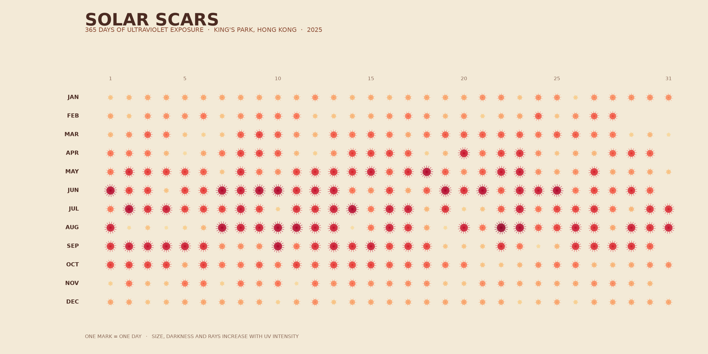

# Solar Scars



## The phenomenon

Solar Scars explores how ultraviolet exposure changes through a year in Hong
Kong. I chose the daily maximum UV Index because it describes an invisible
environmental force that can still damage skin and eyes. The values rise and
fall with the seasons, weather, cloud cover, and atmospheric conditions. I was
interested in turning those measurements into something that looks physical:
each day leaves a small burn-like trace on the page. Looking across the rows
makes the stronger summer period visible, while the irregular pale marks show
that UV exposure does not follow a perfectly smooth seasonal curve.

## The source

The data comes from the [Hong Kong Observatory daily maximum and mean UV Index
dataset](https://data.gov.hk/en-data/dataset/hk-hko-rss-daily-maximum-mean-uv-index).
The committed CSV is the all-year daily maximum UV file for King's Park. It
contains 9,891 observation rows. Each row records a year, month, day, maximum UV
Index value, the 15-minute period when that maximum was recorded, and a data
completeness flag. This project selects the 365 observations from 2025. UV Index
is a dimensionless measure of the potential for ultraviolet radiation to harm
human skin and eyes.

## What the picture shows

The picture arranges 2025 as twelve horizontal month rows. One radial scar
represents one day. Higher UV values produce larger, darker marks with more
rays, so periods of intense exposure appear more heavily burned. The image
keeps the annual pattern and daily variation, but it hides exact numeric values,
the recorded time of each maximum, and the completeness flag. It is designed as
an atmospheric overview rather than a chart for reading precise measurements.

## Run it

```
uv run fetch.py
uv run plot.py
```
