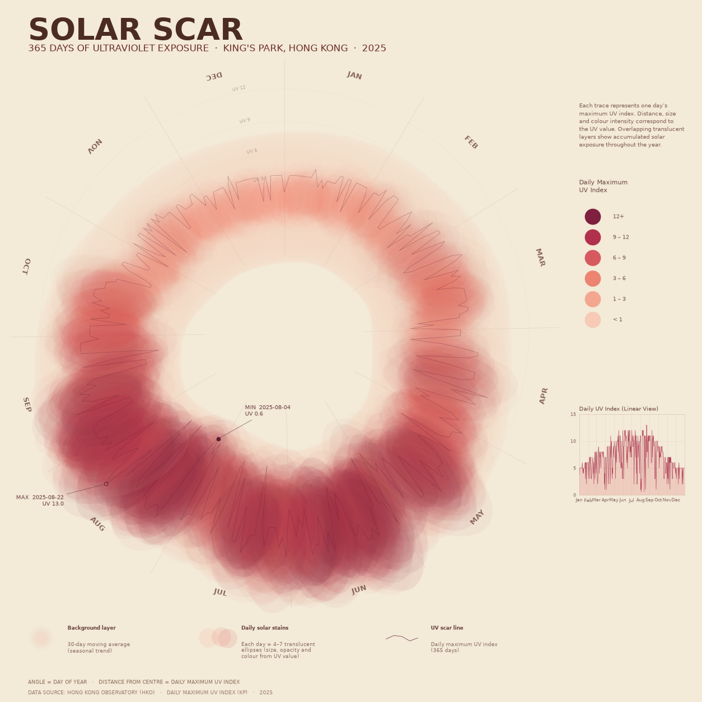

# Solar Scar

## Phenomenon

Solar Scar visualizes how Hong Kong’s daily maximum UV Index changed across
2025 using observations from King’s Park. I chose UV exposure because it is
invisible but changes strongly through the year. The project
turns this invisible solar exposure into a visible, accumulated “scar.”

## Data source

The data comes from the [Hong Kong Observatory King’s Park daily maximum UV
CSV](https://data.weather.gov.hk/weatherAPI/cis/csvfile/KP/ALL/daily_KP_MAXUV_ALL.csv).
The raw file is stored unchanged at `data/daily_KP_MAXUV_ALL.csv` and contains
approximately 9,891 observation rows. One row represents one day, with fields
for year, month, day, maximum UV value, recorded time, and data completeness.
The UV Index is dimensionless. The artwork uses all 365 valid observations from
2025.

## Final picture



## What the picture shows

Angle represents the day of the year, while radial distance represents the
daily maximum UV Index. Each day creates overlapping translucent stains whose
colour, size, depth, and position respond to UV intensity. A thin scar line
retains the raw daily variation. A seasonal background uses a moving average
to reveal the broad annual rhythm. Spring and summer become denser and
darker, while lower-UV periods fade into the background.

## What the picture hides

The exact recorded time and data completeness flags are not visually encoded.
Layering and transparency emphasize seasonal accumulation, so individual
numbers are not equally easy to read precisely.

## Run

```bash
uv run plot.py
```
